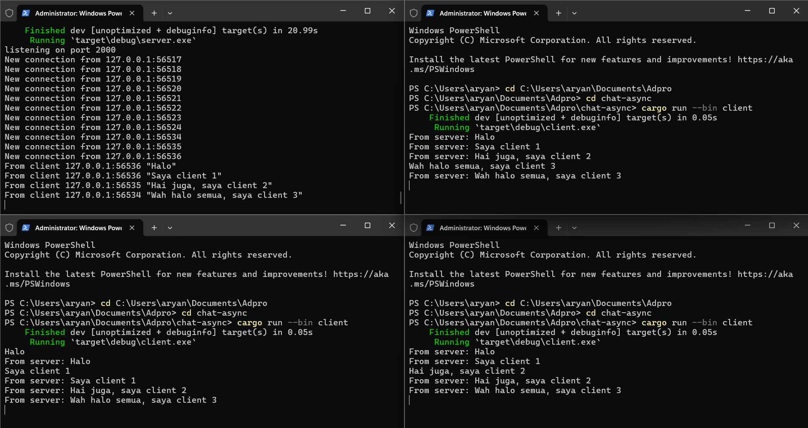

# Original code of broadcast chat

Pada gambar di atas, client dan server saling terhubung melalui websocket. Server akan mendengarkan input pesan dari Client dan meneruskan pesan tersebut ke seluruh client yang ada. Ketika kita membuat pesan di client 1 akan terlihat di seluruh client, begitu juga dengan client 2 atau 3, dan seterusnya.

